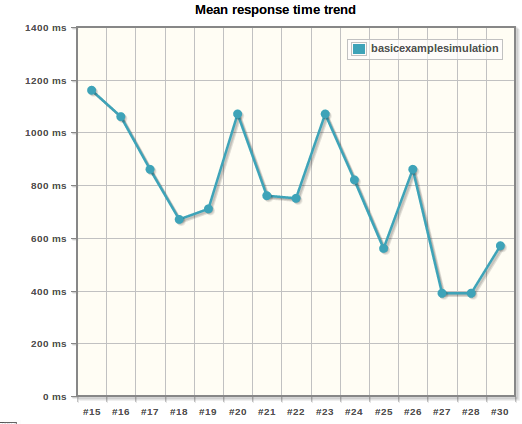
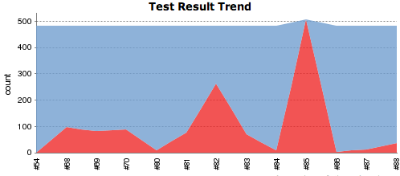
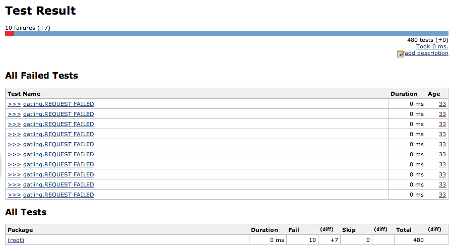

# Do you need a performance testing? Gatling to the rescue!

## Continuous delivery and testing

GoodData and our CloudConnect team in particular is always working hard on delivering valuable and well tested
features in shortest possible time window
following the [Continuous delivery principles](http://www.thoughtworks.com/continuous-delivery principles).
To make this possible we have bunch of various tests:

* unit tests
* integration tests
* acceptance tests (aka "rest tests" in our terminology)
* UI tests

These tests make us pretty confident that our code is well designed and works properly.

## Why we need performance tests? (Real Life Story)

Until very recently there was an illusion we have almost everything we really needed
and there was no real pressure for some kind of performance testing, even for the most critical features.
But time has come.

One of our rest api resources displaying aggregated data from all user's projects (having the performance problems in
past) had to be rewritten to support mutliple datacenters (both AWS and Rackspace),
that is display data from GoodData projects located on both datacenters.
This change required to make even more (parallel) HTTP calls than before.

To compare performance of new solution to the previous one I performed some manual (and quite silly) performance checks.
For one user I loaded a lot of data and called resource multiple times while checking the response time.
So far so good: the response times seems to be pretty similar for both solutions so we decided to deploy the new version to production...

### Things always go wrong

![Rest api calls response statuses] (RestApiCalls.png)

Immediately after the deployment of new version the things went pretty bad.
The number of requests which failed with Internal Server Error (500) status was growing exponentially.
We had only one option - [revert] (http://devopsreactions.tumblr.com/post/71835012718/hot-fixing-live-environment)
to the previous version.

## Once again

To learn from previous experience I'd decided to take a different approach.

### Test first

* As with TDD create performance test for current solution before actual change of code
* More importantly, create realistic test case simulating concurrent users (do you remember me testing the resource manually with single user?)

### Automate

* Performance tests have to be automated, manual testing is cumbersome, error prone and not accurate.
* Automation should be done via our jenkins infrastructure so candidate for performance tool should be able to integrate with jenkins.
* Ideally, it should be able to generate various reports such as standard junit test results.
* Tool should not eat too much resources since our jenkins slaves are used for other tasks as well.
* It should be open source, no heavy commercial testing tools.

### Gatling - The Winner!

Having a little experience with both JMeter and Gatling before, the choice was inevitable:

* **Gatling's clean dsl api** (written in Scala) as opposed to the JMeter misuse of XML.
    *XML is not a programming language* and should not be used that way.
    Using dsl is a great advantage since we want to treat performance tests as a code.

* **High performance** - gatling uses asynchronous concurrency (Scala, Akka, Netty) and asynchronous IO.
    This approach scales a lot better than the standard stress tools using one thread per user.

* Gatling is more modern and viable alternative, it appeared on
    [ThoughtWorks technology radar in 2013 and 2014.] (http://www.thoughtworks.com/radar/#/)
    
As mentioned in [Gatling stress tool made efficient] (https://blog.bluepyth.fr/gatling-stress-tool-made-efficient.html),
the primary motivation for Gatling's creators was to made stress tool which is more efficient and has a clean api

[JMeter and Gatling benchmark] (https://flood.io/blog/13-stress-testing-jmeter-and-gatling)
reveals real difference between JMeter and Gatling scalability.

## Gatling project setup & implementation

Gatling is available as a standalone package from [Gatling project page] (http://gatling-tool.org/)
Right now we are using the stable version 1.5.2. It comes with handy GUI to defining the simple test cases.
However this is not the case we are going to describe here - instead, we want to focus on real code.

Because most of our projects are using maven as a build tool and jenkins supports it out of the box,
I decided to use it for our upcoming performance tests too - check [simple gatling maven project] (https://github.com/jumarko/gatling-sample-project)

The test itself is relatively simple and concise (some parts omitted for brevity):

    /**
     * Perform concurrent requests to resource with different users from user_credentials.csv.
     * For each user the requests are repeated with given pause and count.
     */
    class ConcurrentUsersSimulation extends Simulation {
      val hostUrl = Config.host

      // how many requests per user
      val requestsNumber = 20

      // pause between two subsequent requests for the same user
      val requestPauseSeconds = 15

      // load users' (name, password) combination
      val usersDataSource: Array[Map[String, String]] = csv("user_credentials.csv")

      // perform requests for each user from credentials files in parallel
      private val usersCount: Int = usersDataSource.length
      val scn = {
        scenario("resource test: host=" + hostUrl + ", users_count=" + usersCount)
          .feed(usersDataSource)

            // at the beginning we need to find user id - note the "trick" with saving the result into the "userId" variable
            .exec(http("getUserId")
              .get("/gdc/app/account/bootstrap")
              .basicAuth("${username}", "${password}")
              .check(jsonPath("$.bootstrapResource.current.loginMD5").find.saveAs("userId"))
            )

            /*
             * the performance testing itself - perform multiple requests for each user
             * - requests for one user are not concurrent, there is only one request per user at time
             * - there are multiple concurrent requests for different users
             */
          .repeat(requestsNumber) {
          exec(http("processesView GET")
            .get("/gdc/app/account/profile/${userId}/dataload/processesView").basicAuth("${username}", "${password}"))
            .pause(requestPauseSeconds)
        }
      }

      setUp(scn.users(usersCount).ramp(20).protocolConfig(httpConf))

    }

I won't cover the gatling basics - to get a quick grasp about gatling check
[Getting Started guide] (https://github.com/excilys/gatling/wiki/Getting-Started).

Test steps:

1. Load user accounts for testing from csv file.
1. Get user ID from rest api and save it to the `userId` variable for later reuse.
1. Repeat rest api calls for `requestNumber` times with pause `requestPauseSeconds` between each call
   and do it concurrently for given users.

The most of the calls to our API have to be authenticated.
That's not a big deal - I can simply add basicAuth with username and password read from CSV file.

The interesting part is construction of full uri because I need the to fetch the user ID via rest api at first.
This is done in separate request before the `.repeat(requestsNumber)` part. Id is saved to the variable `userId`
and reused afterwards via handy syntax `${userId}`

## Results

[Gatling jenkins plugin] (https://wiki.jenkins-ci.org/display/JENKINS/Gatling+Plugin) can help to visualize the mean response times:

### Gatling test results in Xunit format

What's more important for us is to be able to determine and easily display
the overall result of performance tests run as well as the number of failed requests in jenkins.
The standard way for doing this in jenkins is to produce test results
in [Xunit format](https://svn.jenkins-ci.org/trunk/hudson/dtkit/dtkit-format/dtkit-junit-model/src/main/resources/com/thalesgroup/dtkit/junit/model/xsd/junit-4.xsd).
Unfortunately, in case of Gatling the only common place where the test results can be found is [gatling log](../gatling.log).

After digging into this problem a little bit deeper I decided to create [groovy script](../ConvertGatlingToXunit.groovy)
to transform results from gatling log to the
[XUnit format supported by jenkins]((http://stackoverflow.com/questions/4922867/junit-xml-format-specification-that-hudson-supports)).

This way we can get better and quicker overview overall test results.

### Test results trend

Following image shows overall trend of one performance results.
The red color represents failed requests. We can see that after some problems we were able to stabilize our resource
lowering the number of failed requests significantly.

### Result of one execution of performance tests:

This image demonstrate a result of one execution of tests.
The total number of requests is 480, 10 requests failed (because of timeout).

## Summary

Gatling and performance testing helped us to reveal and (partially) fix problems in our infrastructure.
We were able to simulate production load pretty closely and after the deployment of new improved version of problematic
resource the number of failed requests came close to zero.

There are still some problems that needs to be solved but performance tests helped us at least discover those issues
and identify the potential bottlenecks.
Right now, we are migrating our CloudConnect infrastructure from Mongo DB to Cassandra
which supports multiple datacenters replication out of the box. This will help us to reduce the number of necessary
HTTP calls even more and, hopefully, the failed requests will fade away in sands of times.

## Resources
* [simple gatling maven project] (https://gist.github.com/jumarko/9183448)
* [Gatling Wiki - Getting Started guide] (https://github.com/excilys/gatling/wiki/Getting-Started)
* [Stress testing JMeter and Gatling] (https://flood.io/blog/13-stress-testing-jmeter-and-gatling)
        shows an interesting comparison of JMeter and Gatling performance.
* [ThoughtWorks radar] (http://www.thoughtworks.com/radar/#/tools) mentions gatling as a tool that is worth to try.
* [Gatling: stress tool made efficient] (https://blog.bluepyth.fr/gatling-stress-tool-made-efficient.html)
   is an interesting story about the gatling development and original reasoning behind it
* [Gatling 2 - What's up Doc] (http://www.slideshare.net/slandelle/gatling-scala-io-27568405)
   is a good presentation about gatling on scala.io conference. Mentions some internals and future plans.
* [Gatling jenkins plugin] (https://wiki.jenkins-ci.org/display/JENKINS/Gatling+Plugin)
* [Jenkins junit xml support ](http://stackoverflow.com/questions/4922867/junit-xml-format-specification-that-hudson-supports)
* [Gatling gun] (http://en.wikipedia.org/wiki/Gatling_gun">Gatling gun)

